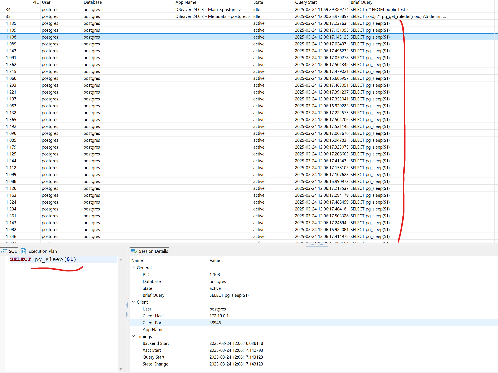
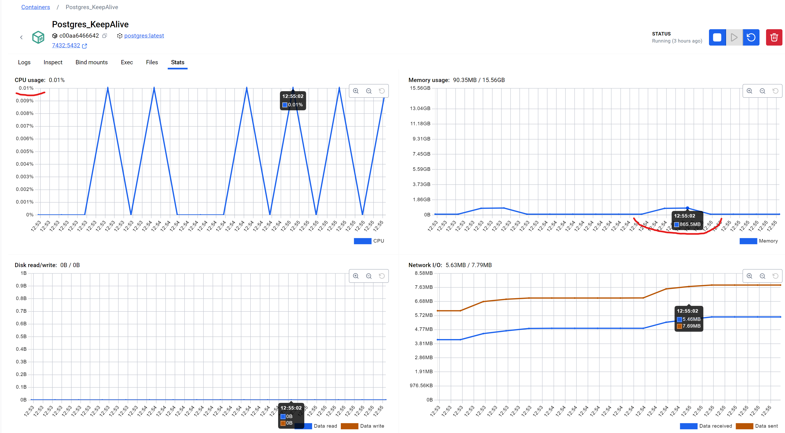

# Выполнение теста
В первые 10 секунд после старта приложения в браузере сессий Dbeaver можно обнаружить 480 одновременно открытых сессий.  
Остальные 120 вызовов метода TestConnection ждут пока в pooling npgsql освободятся соединения.  
По умолчанию таймаут ожидания соединений из pooling равен 15 секунд

Каждая сессия завершится после выполнения ожидания pg_sleep и запроса insert.   
По мере освобождения соединений будут выполнены ожидающие 120 вызовов метода TestConnection.

Если увеличить параметр теста SleepTimeout например до 15 секунд, то выполнится только первая партия запросов, а остальные не дождутся соединений из npgsql pool и упадут по таймауту.   
Если на сервере настроить параметр max_connections < чем суммарное количество всех подключений от всех приложений(включая DBeaver), то попытки открыть подключения сверх лимита приведут к исключениям.

## Результаты теста
```shell
2025-03-24T12:54:45.4623052+02:00 Test with Id = a5b10aee-27c3-49ea-a890-c167592bbc27 started. Total connections: 600. SleepTimeout: 10
2025-03-24T12:55:07.3809202+02:00 Test completed in 21908 ms.
2025-03-24T12:55:07.4003550+02:00 Test added 600 rows. Total connections: 600
```

# Потребление ресурсов
